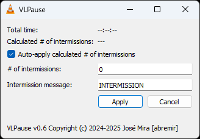

# VLPause for VLC

Automatic pause of video being played.

## Description

This Lua extension for VLC allows the currently playing video to automatically pause a number of times, with a `-- INTERMISSION --` message on screen.

The number of times the video will pause for intermission can be calculated or manually entered. This is defined in the VLPause configuration window.

* **Total time**: the total time of the current video
* **Calculated # of intermissions**: the calculated number of intermissions for the currently playing video
  * will be re-calculated on every start of play
  * the calculated number of intermissions will be (this is a simple algorithm that fits my needs, no science behind this!)
    * for videos less than 1h15m, 0 intermissions
    * otherwise, number of hours in `duration - 1h15m` plus 1
* **Auto-apply calculated # of intermissions**: when checked, only the calculated number of intermissions will always be used (disregarding the value entered in `# of intermissions`)
* **\# of intermissions**: number of intermissions manually entered (will only be used if the aut-apply checkbox is not checked)

## Installation

Copy the [VLPause_ext.lua](./src/VLPause_ext.lua) and [VLPause_intf.lua](./src/VLPause_intf.lua) files to the following folders (depends on your OS) :

* `VLPause_ext.lua` (installation directory `lua/extensions`)
  * Windows (all users): %ProgramFiles%\VideoLAN\VLC\lua\extensions\
  * Windows (current user): %APPDATA%\VLC\lua\extensions\
  * Linux (all users): /usr/lib/vlc/lua/extensions/
  * Linux (current user): ~/.local/share/vlc/lua/extensions/
  * Mac OS X (all users): /Applications/VLC.app/Contents/MacOS/share/lua/extensions/
  * Mac OS X (current user): /Users/%your_name%/Library/Application Support/org.videolan.vlc/lua/extensions/
* `VLPause_intf.lua` (instalation directory `lua/intf`)
  * Windows (all users): %ProgramFiles%\VideoLAN\VLC\lua\intf\
  * Windows (current user): %APPDATA%\VLC\lua\intf\
  * Linux (all users): /usr/lib/vlc/lua/intf/
  * Linux (current user): ~/.local/share/vlc/lua/intf/
  * Mac OS X (all users): /Applications/VLC.app/Contents/MacOS/share/lua/intf/
  * Mac OS X (current user): /Users/%your_name%/Library/Application Support/org.videolan.vlc/lua/intf/

NOTE: Create directories if they do not exist!

Or, take the zip file in the release assets and unzip into the Lua directory.

## Changelog

* 0.6
  * replace static dropdown to select the number of intermissions with text input to allow manual entry
* 0.5
  * replace "automatic skip intermission if suggested is zero" with "auto-apply suggested number of intermissions"
  * calculate suggested number of intermissions instead of relying on a static mapping table
  * refactor loop function to re-calculate variables when input URI changes
  * display number of planned intermissions on start of play
* 0.4
  * allow automatic skip intermission if suggested number of intermissions is zero [obsolete v0.5]
* 0.3
  * allows selection of number of intermissions, up to 5 equal length chunks [obsolete v0.6]
  * add suggested number of intermissions based on duration of input
  * other cosmetic changes
* 0.2
  * fix issue when running on a brand new install of vlc
* 0.1
  * initial version with pausing only at 50% duration of playing item [obsolete v0.3]

## Acknowledgements

* <https://vlc.verg.ca/>
* <https://github.com/GDoux/Perroquet-Subtitles-for-VLC>
* [Lua reference manual](https://www.lua.org/manual/5.4/contents.html#contents)
* [Programming in Lua (first edition)](https://www.lua.org/pil/contents.html)
* [Time v3.2](https://addons.videolan.org/p/1154032/) (c) lubozle
* lua-users wiki - [String Recipes](http://lua-users.org/wiki/StringRecipes)
* [How to dump a table to console?](https://stackoverflow.com/a/27028488/552219)
* [Lua compiler](https://onecompiler.com/lua)
* [Big Buck Bunny](https://www.bigbuckbunny.org) (c) copyright 2008, Blender Foundation / www.bigbuckbunny.org
